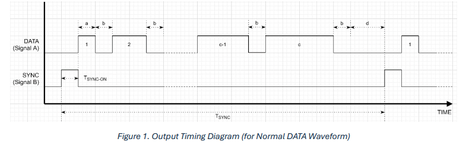

# About
This project includes two different versions of the same application which tries to acheieve the target of generating the waveforms depicted below using esp32 microcontroller.

We need to follow a certain circuit(given below) to acheieve this and the visual debugging of the application.

# INSTALLATIONS
To run this application in windows we first need to install drivers link is mentioned below.
link: [Drivers](https://www.silabs.com/developer-tools/usb-to-uart-bridge-vcp-drivers?tab=downloads)

The first version is in .ino format which can be downloaded and run using the arduino IDE(link to download is mentioned below).
link: [Arduino_IDE](https://www.arduino.cc/en/software)

The second version is in .c format which can be ddownloaded and run using the vscode IDE(link to download is mentioned below) with the help of ESP-IDF extension which can be installed directly in vscode.
link: [Vscode](https://code.visualstudio.com/)

# SETUP
Arrange all the hard ware components as shown in the above circuit diagram and choose any version of the application and appropriate IDE.

# STRUCTURE
B31DG_Assignment-1/  
├── Arduino_IDE/  
│   └── sketch_v1/  
├── ESP_IDF/  
│   ├── main/  
│   │   ├── Data_and_Sync.c  
│   │   └── CMakeLists.txt  
│   ├── .gitignore  
│   ├── dependencies.lock  
│   └── sdkconfig  
├── image-1.png  
└── image.png  
